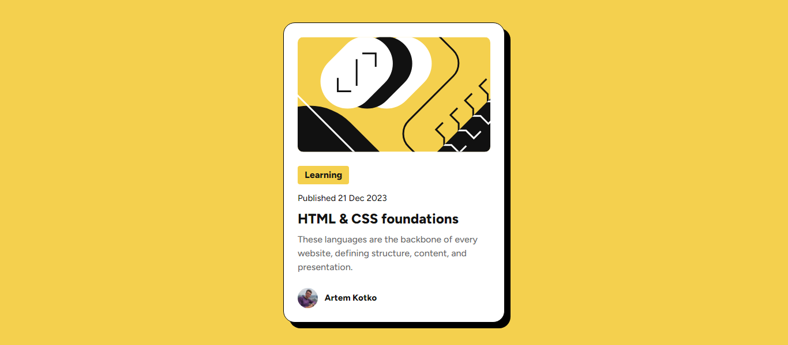

# Frontend Mentor - Blog preview card solution

This is a solution to the [Blog preview card challenge on Frontend Mentor](https://www.frontendmentor.io/challenges/blog-preview-card-ckPaj01IcS). Frontend Mentor challenges help you improve your coding skills by building realistic projects.

## Table of contents

- [Overview](#overview)

  - [The challenge](#the-challenge)
  - [Screenshot](#screenshot)
  - [Links](#links)
  - [Built with](#built-with)
  - [What I learned](#what-i-learned)
  - [Continued development](#continued-development)
  - [Useful resources](#useful-resources)

## Overview

The project of making a Blog Preview Card

### The challenge

Users should be able to:

- See hover and focus states for all interactive elements on the page

### Screenshot



### Links

- Solution URL: [Add solution URL here](https://your-solution-url.com)

### Built with

- Semantic HTML5 markup
- CSS custom properties
- Flexbox
- Customed properties

### What I learned

In this task I was required to build a blog preview card and make hover and focus states for all interactive elements.

First of, I learnt to incorporate a custom CSS reset in my code.

I defined a set of custom properties within the :root selector, allowing for easy theme management and consistent styling across the stylesheet.

I also learned how to provide better accessibility with focus states and hover interactivity.

```css
:focus {
  outline: 2px solid var(--clr-gray-950);
  outline-offset: 2px;
}

.author p:hover,
h2:hover {
  color: var(--clr-yellow);
  cursor: pointer;
}
```

And finally I learned how to make my own avatar

```css
.avatar {
  vertical-align: middle;
  width: 2.2rem;
  height: 2.2rem;
  border-radius: 50%;
}
```

### Continued development

I implemented hover states for buttons and text elements, which I could build upon by adding transitions for smoother effects. This will create a more polished user experience.

For accessibility, I can improve focus states further by making sure that all interactive elements (buttons, links, etc.) have distinct focus styles that stand out on all background colors.

### Useful resources

- https://www.freecodecamp.org/news/css-units-when-to-use-each-one/#heading-rem-rem - This helped me with better understanding of CSS Units.
- https://fedmentor.dev/posts/font-size-px/ - This is an amazing article which explained to me why I shound not use pixels most of the times.
- https://www.w3schools.com/howto/howto_css_image_avatar.asp - This helped me to make my own avatar from my image
